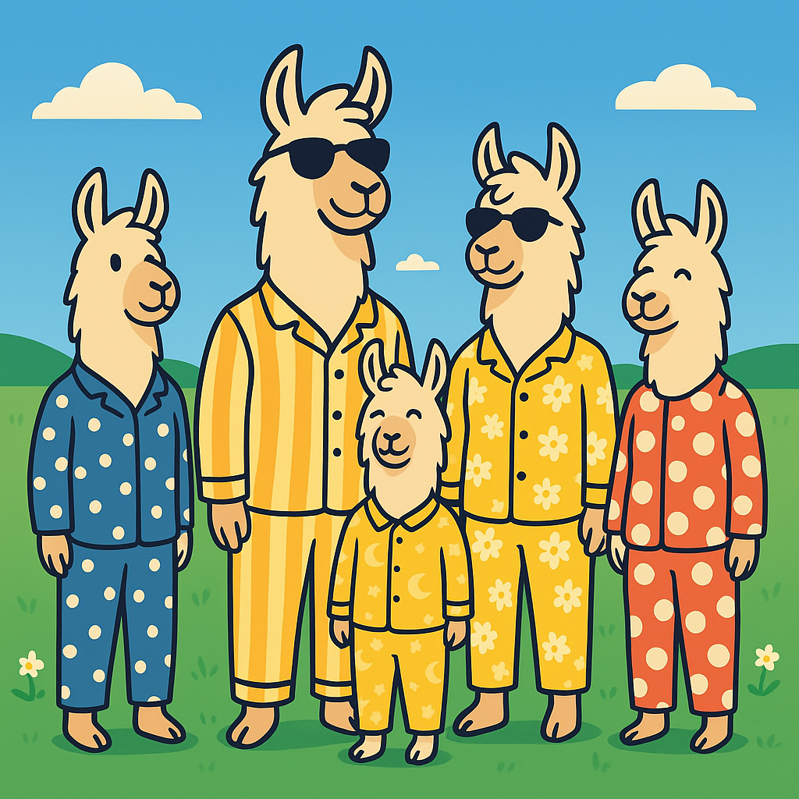

<div align="center">



# Llama-Pajamas 🦙 📦

**Universal Model Quantization & Optimized Runtime System**

[](https://github.com/llama-farm/LlamaPajamas)
[](https://www.python.org/downloads/)
[](LICENSE)
[](https://github.com/llama-farm/LlamaPajamas)

</div>

---

Llama-Pajamas provides a complete pipeline for quantizing and deploying AI models across all modalities (LLM, Vision, Speech) on hardware-optimized runtimes.

> ⚠️ **EXPERIMENTAL**: This project is under active development. APIs may change. Use in production at your own risk.

> **📊 New to LlamaPajamas?** Start with the [Executive Overview](OVERVIEW.md) for high-level architecture, flowcharts, and use cases.
>
> **💡 Tip**: Can't see the flowcharts? Open [OVERVIEW.html](OVERVIEW.html) in your browser, or see [Viewing Guide](VIEWING_GUIDE.md) for other options.

## Our Distinct Point of View

**❌ WRONG: "One runtime fits all hardware"**
- Traditional approach: Same PyTorch model runs everywhere
- Result: Inefficient - no hardware acceleration, large memory footprint
- Result: Slow - CPU-only inference, no GPU/ANE optimization

**✅ RIGHT: "Hardware-optimized quantization + native runtimes"**
- **Llama-Pajamas**: Quantize once → Deploy on optimized runtime per platform
- **Apple Silicon**: MLX (LLM), CoreML (Vision/Speech) with ANE acceleration
- **NVIDIA GPU**: GGUF (LLM), TensorRT (Vision/Speech) with CUDA optimization
- **CPU/Edge**: GGUF (LLM), ONNX (Vision/Speech) for universal compatibility
- Result: **3-10x faster inference**, **50-75% smaller models**, **native hardware acceleration**

## The Complete Pipeline

### 1. Quantization (Offline, Heavy)
Convert full-precision models to compressed formats:
- **LLM**: GGUF (Q4_K_M, IQ2_XS) + MLX (4-bit, 2-bit)
- **Vision**: CoreML (INT8), TensorRT (FP16/INT8), ONNX (INT8)
- **Speech**: CoreML (INT8), ONNX (FP32)


## Quick Start

### LLM: Quantize and Run Qwen3-8B

```bash
# 1. Quantize to GGUF Q4_K_M (4.6 GB, industry standard)
cd quant
uv run python scripts/quantize_llm.py \
  --model Qwen/Qwen3-8B \
  --output ./models/qwen3-8b \
  --formats gguf \
  --gguf-precision Q4_K_M

# 2. Run inference
cd ../run
uv run python examples/simple_usage.py
# Output: ~80 tok/s on M3 Max, ~70 tok/s on RTX 4070
```

### Vision: Quantize and Run YOLO

```bash
# 1. Export to CoreML with INT8 quantization
cd quant
uv run python scripts/export_model.py \
  --model yolov8n \
  --backend coreml \
  --precision int8 \
  --output models/yolo-v8n/

# 2. Run inference
cd ../run-coreml
uv run python examples/test_vision.py
# Output: ~40 FPS on M3 Max (INT8 with ANE)
```

### Speech: Transcribe Audio with Whisper

```bash
# 1. Export to CoreML INT8
cd quant
uv run python scripts/quantize_whisper_coreml.py --model whisper-tiny

# 2. Transcribe audio
cd ../run-coreml
uv run python examples/test_stt.py
# Output: 31x faster than real-time (RTF: 0.032)
```

## Project Structure

```
llama-pajamas/
├── quant/                    # Quantization Pipeline (llama-pajamas-quant)
│   ├── llama_pajamas_quant/
│   │   ├── core/            # Architecture detection
│   │   ├── converters/      # GGUF, MLX converters
│   │   ├── exporters/       # ONNX, unified export
│   │   └── quantizers/      # ONNX quantization
│   ├── scripts/             # CLI scripts
│   ├── evaluation/          # LLM, Vision, STT evaluation
│   └── models/              # Quantized models output
│
├── run/                      # LLM Runtime (GGUF/MLX)
│   └── llama_pajamas_run/
│       ├── backends/        # GGUF, MLX backends
│       └── benchmarks.py    # Performance testing
│
├── run-core/                 # Shared runtime core
│   └── llama_pajamas_run_core/
│       ├── backends/        # Base classes
│       └── utils/           # Audio, image utilities
│
├── run-coreml/              # CoreML Runtime (Vision/Speech)
│   └── llama_pajamas_run_coreml/
│       ├── backends/        # Vision, STT backends
│       └── server.py        # Multi-modal API server
│
├── run-onnx/                # ONNX Runtime (Edge deployment)
│   └── llama_pajamas_run_onnx/
│       └── backends/        # Vision, Speech backends
│
└── run-tensorrt/            # TensorRT Runtime (NVIDIA GPU)
    └── llama_pajamas_run_tensorrt/
        └── backends/        # Vision, LLM backends
```

---

# LLM Pipeline (Text Generation)

## 1. Quantization (Offline)

### Standard Quantization (Q4_K_M - Recommended)

```bash
cd quant

# Dual-format: GGUF + MLX (one command)
uv run python scripts/quantize_llm.py \
  --model Qwen/Qwen3-8B \
  --output ./models/qwen3-8b \
  --formats gguf,mlx \
  --gguf-precision Q4_K_M \
  --mlx-bits 4

# Output:
# models/qwen3-8b/
#   ├── gguf/Q4_K_M/model.gguf      (4.68 GB)
#   ├── mlx/4bit-mixed/             (4.31 GB)
#   └── manifest.json
```

**Result**: 3.3x compression, <5% quality loss, industry standard

### Extreme Compression (IQ2_XS - 50% smaller)

**What are IQ methods?** Importance Quantization (IQ) uses calibration data to identify critical weights and preserve them at higher precision. This achieves better quality than standard quantization at ultra-low bit rates.

**How it works:**
1. Generate calibration data (diverse prompts)
2. Run model on calibration data to identify important weights
3. Apply variable precision: Critical weights → higher bits, Less important → lower bits
4. Result: Better quality than uniform quantization at same size

```bash
cd quant

# Step 1: Generate calibration data (140 diverse prompts)
uv run python -c "
from llama_pajamas_quant.simple_benchmarks import TEST_PROMPTS
with open('calibration.txt', 'w') as f:
    for prompt in TEST_PROMPTS:
        f.write(prompt['prompt'] + '\n\n')
"

# Step 2: Generate importance matrix
cd ../libs/llama.cpp
./llama-imatrix \
  -m ../../quant/models/qwen3-8b/gguf/Q4_K_M/*.gguf \
  -f ../../quant/calibration.txt \
  -o ../../quant/qwen3-8b.imatrix \
  --chunks 512

# Step 3: Quantize with importance matrix
./llama-quantize \
  --imatrix ../../quant/qwen3-8b.imatrix \
  ../../quant/models/qwen3-8b/gguf/Q4_K_M/*.gguf \
  ../../quant/models/qwen3-8b/gguf/IQ2_XS/model.gguf \
  IQ2_XS

# Step 4: MLX 2-bit (for Apple Silicon)
cd ../../quant
uv run python scripts/quantize_llm.py \
  --model Qwen/Qwen3-8B \
  --output ./models/qwen3-8b \
  --formats mlx \
  --mlx-bits 2
```

**Result**: ~2.4 GB (GGUF IQ2_XS) + ~2.4 GB (MLX 2-bit) = 53% size reduction vs Q4_K_M

**Quality comparison:**
- **Q4_K_M**: 4.6 GB, 94% accuracy (industry standard)
- **IQ3_M**: 3.5 GB, 90-93% accuracy (good balance)
- **IQ2_XS**: 2.4 GB, 85-90% accuracy (with imatrix, usable)
- **IQ2_XXS**: 2.2 GB, 80-85% accuracy (extreme compression)

**Where to find quantized models:**
```
models/qwen3-8b/
├── gguf/
│   ├── Q4_K_M/model.gguf        # Industry standard (4.6 GB)
│   ├── Q3_K_M/model.gguf        # Smaller alternative (3.8 GB)
│   ├── IQ2_XS/model.gguf        # Extreme compression (2.4 GB)
│   └── Q5_K_M/model.gguf        # High quality (5.3 GB)
└── mlx/
    ├── 4bit-mixed/              # Standard MLX (4.3 GB)
    ├── 3bit-mixed/              # Smaller MLX (3.2 GB)
    └── 2bit-mixed/              # Extreme MLX (2.4 GB)
```

## 2. Runtime (Online)

### LLM Runtime - Complete API Guide

#### Basic Text Generation (GGUF - Universal)

```python
# run/examples/llm_basic.py
from llama_pajamas_run import RuntimeConfig, ModelLoader

# Configuration
config = RuntimeConfig(
    backend="gguf",
    model_path="./models/qwen3-8b/gguf/Q4_K_M/model.gguf",
    n_gpu_layers=-1,      # -1 = all layers to GPU, 0 = CPU only, N = specific layers
    n_ctx=4096,           # Context window size
    n_threads=8,          # CPU threads (if not using GPU)
    temperature=0.7,      # Sampling temperature (0.0 = deterministic)
    top_p=0.9,           # Nucleus sampling
    top_k=40,            # Top-K sampling
    repeat_penalty=1.1,   # Penalize repetition
)

# Simple generation
with ModelLoader(config) as loader:
    response = loader.generate(
        "Write a Python function to reverse a string:",
        max_tokens=200,
        stop=["```", "\n\n\n"]  # Stop sequences
    )
    print(response)
```

**Performance**: ~70 tok/s (NVIDIA RTX 4070), ~80 tok/s (Apple M3 Max with Metal)

#### Chat API (OpenAI-compatible)

```python
# Chat with conversation history
with ModelLoader(config) as loader:
    messages = [
        {"role": "system", "content": "You are a helpful Python programming assistant."},
        {"role": "user", "content": "How do I reverse a string in Python?"},
        {"role": "assistant", "content": "You can use slicing: `text[::-1]`"},
        {"role": "user", "content": "Can you show me a function?"},
    ]

    response = loader.chat(messages, max_tokens=300)

    # Extract response
    answer = response["choices"][0]["message"]["content"]
    print(answer)

    # Add to conversation
    messages.append({"role": "assistant", "content": answer})
```

#### Streaming Generation (Real-time)

```python
# Stream tokens as they're generated
with ModelLoader(config) as loader:
    print("Assistant: ", end="", flush=True)

    for chunk in loader.generate("Explain quantum computing:", stream=True):
        print(chunk, end="", flush=True)

    print()  # Newline at end
```

#### MLX Runtime (Apple Silicon - Optimized)

```python
# run/examples/llm_mlx.py
from llama_pajamas_run import RuntimeConfig, ModelLoader

config = RuntimeConfig(
    backend="mlx",
    model_path="./models/qwen3-8b/mlx/4bit-mixed/",
    max_tokens=2048,
    temperature=0.7,
)

# MLX uses unified memory - no need to specify GPU layers
with ModelLoader(config) as loader:
    # Streaming chat
    messages = [
        {"role": "system", "content": "You are a helpful assistant."},
        {"role": "user", "content": "Explain neural networks in simple terms."},
    ]

    print("Assistant: ", end="", flush=True)
    full_response = ""

    for chunk in loader.chat(messages, stream=True):
        content = chunk["choices"][0]["delta"].get("content", "")
        print(content, end="", flush=True)
        full_response += content

    print()
```

**Performance**: ~80 tok/s on M3 Max (10-20% faster than GGUF on Mac)

#### Batch Processing

```python
# Process multiple prompts efficiently
prompts = [
    "What is Python?",
    "What is JavaScript?",
    "What is Rust?",
]

with ModelLoader(config) as loader:
    for prompt in prompts:
        response = loader.generate(prompt, max_tokens=100)
        print(f"Q: {prompt}\nA: {response}\n")
```

#### Token Counting and Context Management

```python
# Check token counts before generation
with ModelLoader(config) as loader:
    text = "Your long input text here..."

    # Count tokens (if backend supports it)
    if hasattr(loader, 'count_tokens'):
        token_count = loader.count_tokens(text)
        print(f"Input tokens: {token_count}")
        print(f"Available context: {config.n_ctx - token_count}")

    # Truncate if needed
    max_input_tokens = config.n_ctx - 500  # Reserve 500 for response
    if token_count > max_input_tokens:
        # Implement truncation logic
        pass
```

## 3. Evaluation

### Run Full Benchmark (140 questions across 6 categories)

```bash
cd quant

# Benchmark both GGUF and MLX (full comparison)
uv run python evaluation/llm/benchmark_models.py \
    --model-dir ./models/qwen3-8b

# Quick test (10 questions per model)
uv run python evaluation/llm/run_eval.py \
    --model-path ./models/qwen3-8b/gguf/Q4_K_M/*.gguf \
    --format gguf \
    --num-questions 10
```

**Categories tested:**
- Knowledge (MMLU-style): 25 questions
- Common Sense (HellaSwag): 15 questions
- Math (GSM8K): 40 questions
- Reasoning (ARC): 20 questions
- Truthfulness (TruthfulQA): 20 questions
- Tool Calling (BFCL): 20 questions

### Universal Comparison (Works for LLM, Vision, Speech!)

```bash
# Compare specific model (auto-detects type)
uv run python evaluation/compare_models.py --model-dir ./models/qwen3-8b
uv run python evaluation/compare_models.py --model-dir ./models/yolo-v8n
uv run python evaluation/compare_models.py --model-dir ./models/whisper-tiny

# Compare ALL models
uv run python evaluation/compare_models.py

# View results
cat ./models/qwen3-8b/COMPARISON.md
```

**Example results:**

```markdown
## LLM Performance Comparison

| Format | Accuracy | Speed (s/q) | Size |
|--------|----------|-------------|------|
| MLX 4bit | 95.7% (134/140) | 0.69s | 938.4 MB |
| GGUF Q4_K_M | 95.0% (133/140) | 0.47s | 1.19 GB |

**Analysis:**
- 🏆 Most Accurate: MLX 4bit (95.7%)
- ⚡ Fastest: GGUF Q4_K_M (0.47s/question)
- 💾 Smallest: MLX 4bit (938.4 MB)
- GGUF Q4_K_M is 33% faster than MLX 4bit
```

---

# Vision Pipeline (Object Detection, Classification)

## 1. Unified Export (All Backends)

```bash
cd quant

# CoreML (Apple Silicon, ANE acceleration)
uv run python scripts/export_model.py \
  --model yolov8n \
  --backend coreml \
  --precision float16 \
  --output models/yolo-v8n/

# ONNX (CPU, AMD GPU, Intel GPU, Edge)
uv run python scripts/export_model.py \
  --model yolov8n \
  --backend onnx \
  --precision int8 \
  --output models/yolo-v8n/

# TensorRT (NVIDIA GPU) - Step 1: Export to ONNX
uv run python scripts/export_model.py \
  --model yolov8n \
  --backend tensorrt \
  --precision fp16 \
  --output models/yolo-v8n/
# Step 2: Build TensorRT engine (requires NVIDIA GPU or Docker)
./quant/scripts/build_tensorrt_engine.sh \
    quant/models/yolo-v8n/tensorrt/fp16/yolov8n.onnx \
    quant/models/yolo-v8n/tensorrt/fp16/yolov8n.engine \
    fp16
```

## 2. CoreML Quantization (Apple Silicon)

### Post-Training INT8 Quantization (50% size reduction)

```bash
cd quant

# Quantize all vision models to INT8
uv run python scripts/quantize_coreml_vision.py --model all --precision int8

# Quantize specific model
uv run python scripts/quantize_coreml_vision.py --model vit-base --precision int8

# Quantize to INT4 (experimental, 75% reduction)
uv run python scripts/quantize_coreml_vision.py --model vit-base --precision int4
```

**Results:**
- **ViT-Base**: 165 MB → 83 MB (49.7% reduction, +2.4% FPS gain)
- **CLIP-ViT-Base**: 167 MB → 83.8 MB (49.8% reduction, -4.3% FPS)
- **YOLO-v8n**: ⚠️ INT8 not supported reliably (use FP16)

**Where to find models:**
```
models/vit-base/
├── coreml/
│   ├── fp16/model.mlpackage      (165 MB)
│   └── int8/model.mlpackage      (83 MB)
└── QUANTIZATION_REPORT.md
```

## 3. ONNX Quantization (Edge Deployment)

**INT8 dynamic quantization** (72.8% size reduction):

```bash
cd quant

# Already done via unified export
uv run python scripts/export_model.py \
  --model yolov8n \
  --backend onnx \
  --precision int8 \
  --output models/yolo-v8n/

# Output: 12.2 MB FP32 → 3.3 MB INT8
```

**Note**: INT8 models require GPU execution providers (TensorRT, OpenVINO, DirectML). For CPU-only deployment, use FP32.

## 4. Runtime (Online)

### Vision Runtime - Complete API Guide

#### Object Detection (CoreML - Apple Silicon)

```python
# run-coreml/examples/vision_detection.py
from llama_pajamas_run_coreml.backends.vision import CoreMLVisionBackend
from llama_pajamas_run_core.utils.image_utils import load_image, draw_boxes
from PIL import Image
import numpy as np

backend = CoreMLVisionBackend()

# Load INT8 model (optimized for ANE)
backend.load_model(
    model_path="./models/yolo-v8n/coreml/int8/model.mlpackage",
    model_type="detection"
)

# Method 1: Load from file
image = Image.open("image.jpg")

# Method 2: Load from URL
# from llama_pajamas_run_core.utils.image_utils import load_image_from_url
# image = load_image_from_url("https://example.com/image.jpg")

# Method 3: From numpy array (e.g., video frame)
# frame = np.random.randint(0, 255, (480, 640, 3), dtype=np.uint8)
# image = Image.fromarray(frame)

# Run detection
detections = backend.detect(
    image,
    confidence_threshold=0.5,  # Minimum confidence
    iou_threshold=0.45,         # NMS threshold
    max_detections=100          # Maximum boxes to return
)

# Process results
for det in detections:
    print(f"Found: {det['class']} ({det['confidence']:.1%})")
    print(f"  BBox: {det['bbox']}")  # [x1, y1, x2, y2]

# Draw boxes on image
output_image = draw_boxes(image, detections)
output_image.save("output.jpg")
```

**Performance**: ~40 FPS (INT8 with ANE), ~13-15 FPS (FP16)

#### Image Classification

```python
# Classification with ViT/CLIP models
backend = CoreMLVisionBackend()
backend.load_model(
    model_path="./models/vit-base/coreml/int8/model.mlpackage",
    model_type="classification"
)

image = Image.open("photo.jpg")
predictions = backend.classify(image, top_k=5)

for pred in predictions:
    print(f"{pred['label']}: {pred['confidence']:.1%}")
```

#### Image Embeddings (CLIP)

```python
# Generate embeddings for similarity search
backend = CoreMLVisionBackend()
backend.load_model(
    model_path="./models/clip-vit-base/coreml/fp16/model.mlpackage",
    model_type="embedding"
)

# Embed single image
image = Image.open("query.jpg")
embedding = backend.embed(image)  # Returns numpy array (e.g., 512-dim)

# Batch embedding for efficiency
images = [Image.open(f"image_{i}.jpg") for i in range(10)]
embeddings = backend.embed_batch(images)  # Shape: (10, 512)

# Compute similarity
import numpy as np
similarity = np.dot(embeddings[0], embeddings[1])
print(f"Similarity: {similarity:.3f}")
```

#### ONNX Runtime (Universal - CPU/GPU)

```python
# run-onnx/examples/vision_onnx.py
from llama_pajamas_run_onnx.backends.vision import ONNXVisionBackend
from PIL import Image

backend = ONNXVisionBackend()

# CPU execution (portable)
backend.load_model(
    "models/yolo-v8n/onnx/yolov8n.onnx",
    model_type="detection",
    providers=["CPUExecutionProvider"],
    num_threads=4,
)

# NVIDIA GPU with TensorRT (fastest)
# backend.load_model(
#     "models/yolo-v8n/onnx/yolov8n.onnx",
#     providers=["TensorrtExecutionProvider", "CUDAExecutionProvider", "CPUExecutionProvider"],
# )

# Intel GPU/CPU with OpenVINO
# backend.load_model(
#     "models/yolo-v8n/onnx/yolov8n.onnx",
#     providers=["OpenVINOExecutionProvider", "CPUExecutionProvider"],
# )

# AMD GPU with DirectML (Windows)
# backend.load_model(
#     "models/yolo-v8n/onnx/yolov8n.onnx",
#     providers=["DmlExecutionProvider", "CPUExecutionProvider"],
# )

# Inference (same API regardless of backend)
image = Image.open("image.jpg")
detections = backend.detect(image, confidence_threshold=0.5)
```

**Performance**: ~19 FPS (M3 Max CPU), ~400 FPS (RTX 4090 with TensorRT)

#### Batch Processing (Video/Multiple Images)

```python
# Process video frames or image batches
import cv2

backend = CoreMLVisionBackend()
backend.load_model(
    model_path="./models/yolo-v8n/coreml/int8/model.mlpackage",
    model_type="detection"
)

# Video processing
cap = cv2.VideoCapture("video.mp4")

while cap.isOpened():
    ret, frame = cap.read()
    if not ret:
        break

    # Convert BGR to RGB
    frame_rgb = cv2.cvtColor(frame, cv2.COLOR_BGR2RGB)
    image = Image.fromarray(frame_rgb)

    # Detect objects
    detections = backend.detect(image, confidence_threshold=0.5)

    # Draw results
    for det in detections:
        x1, y1, x2, y2 = map(int, det['bbox'])
        cv2.rectangle(frame, (x1, y1), (x2, y2), (0, 255, 0), 2)
        cv2.putText(frame, det['class'], (x1, y1-10),
                   cv2.FONT_HERSHEY_SIMPLEX, 0.5, (0, 255, 0), 2)

    cv2.imshow('Detection', frame)
    if cv2.waitKey(1) & 0xFF == ord('q'):
        break

cap.release()
cv2.destroyAllWindows()
```

## 5. Evaluation

```bash
cd run-coreml

# Evaluate all vision models
uv run python ../quant/evaluation/vision/run_eval.py \
    --models-dir ../quant/models \
    --images ../quant/evaluation/vision/images/detection

# Evaluate specific model
uv run python ../quant/evaluation/vision/run_eval.py \
    --model yolo-v8n \
    --models-dir ../quant/models \
    --images ../quant/evaluation/vision/images/detection

# Custom detection threshold
uv run python ../quant/evaluation/vision/run_eval.py \
    --model yolo-v8n \
    --conf-threshold 0.3 \
    --models-dir ../quant/models \
    --images ../quant/evaluation/vision/images/detection

# View results
cat ../quant/models/yolo-v8n/EVALUATION_REPORT.md
```

**Results:**
```
models/yolo-v8n/
├── coreml/fp16/evaluation.json      # 34.3 FPS, 29.1ms latency
├── coreml/int8/evaluation.json      # 40.0 FPS, 25.0ms latency
└── EVALUATION_REPORT.md
```

---

# Speech Pipeline (Speech-to-Text)

## 1. Export to CoreML

```bash
cd quant

# Export all Whisper models to CoreML FP16
uv run python scripts/export_whisper_coreml.py --model all --precision float16

# Export specific model
uv run python scripts/export_whisper_coreml.py --model whisper-tiny --precision float16
```

**Models available:**
- whisper-tiny: 39M params, 15.7 MB encoder
- whisper-base: 74M params, 39.3 MB encoder
- whisper-small: 244M params, 168.3 MB encoder

## 2. Quantize to INT8 (50% size reduction)

```bash
cd quant

# Quantize all Whisper encoders to INT8
uv run python scripts/quantize_whisper_coreml.py --model all

# Quantize specific model
uv run python scripts/quantize_whisper_coreml.py --model whisper-tiny
```

**Results:**
| Model | FP16 Size | INT8 Size | Reduction | WER Change |
|-------|-----------|-----------|-----------|------------|
| whisper-tiny | 15.7 MB | 7.9 MB | 49.7% | -0.004 (better) |
| whisper-base | 39.3 MB | 19.8 MB | 49.6% | 0.000 (same) |
| whisper-small | 168.3 MB | 84.5 MB | 49.8% | 0.000 (same) |

**Recommendation**: Use INT8 as default (50% smaller, no quality loss)

## 3. Export to ONNX (Edge Deployment)

```bash
cd quant

# Export Whisper to ONNX
uv run python scripts/export_model.py \
  --model whisper-tiny \
  --backend onnx \
  --precision fp32 \
  --output models/whisper-tiny/
```

## 4. Runtime (Online)

### Speech Runtime - Complete API Guide

#### Basic Transcription (CoreML - Apple Silicon)

```python
# run-coreml/examples/speech_transcribe.py
from llama_pajamas_run_coreml.backends.stt import CoreMLSTTBackend
from llama_pajamas_run_core.utils.audio_utils import load_audio
import numpy as np

backend = CoreMLSTTBackend()

# Load INT8 model (optimized for ANE)
backend.load_model(
    model_path="./models/whisper-tiny/coreml/int8/encoder.mlpackage",
    model_name="tiny"
)

# Method 1: Load from audio file (supports .wav, .mp3, .flac, .m4a, .ogg)
audio = load_audio("audio.flac", sample_rate=16000)

# Method 2: Load from bytes (e.g., from API request)
# with open("audio.wav", "rb") as f:
#     audio_bytes = f.read()
# audio = load_audio(audio_bytes, sample_rate=16000)

# Method 3: From numpy array (e.g., microphone input)
# audio = np.random.randn(16000 * 5).astype(np.float32)  # 5 seconds

# Basic transcription
result = backend.transcribe(audio, sample_rate=16000)

print(f"Text: {result.text}")
print(f"Language: {result.language}")
print(f"Confidence: {result.confidence:.2f}")
```

**Performance**: 31x faster than real-time (RTF: 0.032)

#### Advanced Transcription Options

```python
# Transcription with options
result = backend.transcribe(
    audio,
    sample_rate=16000,
    language="en",              # Force language (None = auto-detect)
    task="transcribe",          # "transcribe" or "translate" (to English)
    initial_prompt="Technical podcast about AI",  # Context hint
    word_timestamps=True,       # Get word-level timestamps
    vad_filter=True,           # Voice Activity Detection
)

# Access detailed results
print(f"Full text: {result.text}")
print(f"Detected language: {result.language}")
print(f"Language probability: {result.language_probability:.2f}")

# Word-level timestamps
if result.words:
    for word in result.words:
        print(f"{word.start:.2f}s - {word.end:.2f}s: {word.word}")
```

#### Real-time Streaming Transcription

```python
# Stream audio in chunks (e.g., from microphone)
import pyaudio
import queue

# Audio stream setup
CHUNK = 1024
RATE = 16000
audio_queue = queue.Queue()

def audio_callback(in_data, frame_count, time_info, status):
    audio_queue.put(np.frombuffer(in_data, dtype=np.float32))
    return (None, pyaudio.paContinue)

p = pyaudio.PyAudio()
stream = p.open(
    format=pyaudio.paFloat32,
    channels=1,
    rate=RATE,
    input=True,
    frames_per_buffer=CHUNK,
    stream_callback=audio_callback
)

stream.start_stream()

# Process in chunks
audio_buffer = []
while stream.is_active():
    try:
        chunk = audio_queue.get(timeout=1)
        audio_buffer.append(chunk)

        # Process every 3 seconds
        if len(audio_buffer) * CHUNK >= RATE * 3:
            audio_data = np.concatenate(audio_buffer)
            result = backend.transcribe(audio_data, sample_rate=RATE)
            print(f"Transcription: {result.text}")
            audio_buffer = []
    except queue.Empty:
        break

stream.stop_stream()
stream.close()
p.terminate()
```

#### Batch Processing (Multiple Files)

```python
# Transcribe multiple audio files efficiently
import os
from pathlib import Path

audio_dir = Path("audio_files")
results = []

for audio_file in audio_dir.glob("*.wav"):
    print(f"Processing: {audio_file.name}")

    audio = load_audio(str(audio_file), sample_rate=16000)
    result = backend.transcribe(audio, sample_rate=16000)

    results.append({
        "file": audio_file.name,
        "text": result.text,
        "language": result.language,
        "duration": len(audio) / 16000
    })

# Save results
import json
with open("transcriptions.json", "w") as f:
    json.dump(results, f, indent=2)
```

#### ONNX Runtime (Universal - CPU/GPU)

```python
# run-onnx/examples/speech_onnx.py
from llama_pajamas_run_onnx.backends.speech import ONNXSpeechBackend
from llama_pajamas_run_core.utils.audio_utils import load_audio

backend = ONNXSpeechBackend()

# CPU execution
backend.load_model(
    encoder_path="models/whisper-tiny/onnx/tiny_encoder.onnx",
    model_name="whisper-tiny",
    providers=["CPUExecutionProvider"],
)

# NVIDIA GPU (faster)
# backend.load_model(
#     encoder_path="models/whisper-tiny/onnx/tiny_encoder.onnx",
#     providers=["CUDAExecutionProvider", "CPUExecutionProvider"],
# )

audio = load_audio("audio.wav", sample_rate=16000)
result = backend.transcribe(audio, sample_rate=16000)
print(result.text)
```

#### Audio Format Conversion Helpers

```python
# Helper utilities for audio processing
from llama_pajamas_run_core.utils.audio_utils import (
    load_audio,
    resample_audio,
    convert_to_mono,
    normalize_audio,
    trim_silence
)

# Load and preprocess
audio = load_audio("recording.mp3", sample_rate=44100)

# Convert to Whisper format (16kHz, mono, normalized)
audio = resample_audio(audio, orig_sr=44100, target_sr=16000)
audio = convert_to_mono(audio)
audio = normalize_audio(audio)
audio = trim_silence(audio, threshold=0.01)

# Transcribe
result = backend.transcribe(audio, sample_rate=16000)
```

## 5. Evaluation

```bash
cd quant

# Download LibriSpeech audio samples (10 samples)
cd evaluation/stt
uv run python download_audio.py --num-samples 10

# Evaluate all Whisper models
cd ../../run-coreml
uv run python ../quant/evaluation/stt/run_eval.py \
    --models-dir ../quant/models

# Evaluate specific model
uv run python ../quant/evaluation/stt/run_eval.py \
    --models-dir ../quant/models \
    --model whisper-tiny

# View results
cat ../quant/models/whisper-tiny/EVALUATION_REPORT.md
```

**Results:**
| Model | Size | WER | Latency | RTF | Best For |
|-------|------|-----|---------|-----|----------|
| whisper-tiny | 15.7 MB | 9.2% | 249ms | 0.032 | Mobile, embedded |
| whisper-base | 39.3 MB | 5.1% | 542ms | 0.070 | Balanced |
| whisper-small | 168.3 MB | 0.9% | 983ms | 0.126 | Best quality |

**Metrics:**
- **WER** (Word Error Rate): Lower is better (0% = perfect)
- **RTF** (Real-time Factor): <1.0 = faster than real-time
- All models run faster than real-time with ANE acceleration

---

# Multi-Modal Server (OpenAI-Compatible API)

## Starting the Server

```bash
cd run-coreml

# Start with Vision + STT
uv run python examples/multimodal_server_demo.py

# Server starts on http://localhost:8000
```

## API Endpoints

### Vision - Object Detection

```bash
# Detect objects in image
curl -X POST http://localhost:8000/v1/images/detect \
  -H "Content-Type: application/json" \
  -d '{
    "image": "data:image/jpeg;base64,...",
    "confidence_threshold": 0.5,
    "iou_threshold": 0.45
  }'
```

### Vision - Classification

```bash
# Classify image
curl -X POST http://localhost:8000/v1/images/classify \
  -H "Content-Type: application/json" \
  -d '{"image": "data:image/jpeg;base64,...", "top_k": 5}'
```

### Vision - Embeddings (CLIP)

```bash
# Generate image embeddings
curl -X POST http://localhost:8000/v1/images/embed \
  -H "Content-Type: application/json" \
  -d '{"image": "data:image/jpeg;base64,..."}'
```

### Speech-to-Text (OpenAI-Compatible)

```bash
# Transcribe audio (OpenAI-compatible endpoint)
curl -X POST http://localhost:8000/v1/audio/transcriptions \
  -F file=@audio.wav \
  -F model=whisper-tiny \
  -F response_format=json

# With language hint
curl -X POST http://localhost:8000/v1/audio/transcriptions \
  -F file=@audio.wav \
  -F model=whisper-tiny \
  -F language=en \
  -F response_format=verbose_json
```

### Management

```bash
# Health check
curl http://localhost:8000/health

# List loaded models
curl http://localhost:8000/v1/models
```

## Python Client

```python
import requests
import base64
from PIL import Image
import io

# Object detection
with Image.open("image.jpg") as img:
    buffer = io.BytesIO()
    img.save(buffer, format="JPEG")
    img_base64 = base64.b64encode(buffer.getvalue()).decode()

response = requests.post(
    "http://localhost:8000/v1/images/detect",
    json={
        "image": f"data:image/jpeg;base64,{img_base64}",
        "confidence_threshold": 0.5,
    }
)
detections = response.json()["detections"]

# Speech-to-text
with open("audio.wav", "rb") as f:
    response = requests.post(
        "http://localhost:8000/v1/audio/transcriptions",
        files={"file": ("audio.wav", f, "audio/wav")},
        data={"model": "whisper-tiny", "response_format": "json"}
    )
transcription = response.json()["text"]
```

**Architecture:**
- **Core Server** (`run-core/server_multimodal.py`): Shared FastAPI app factory
- **CoreML Server** (`run-coreml/server.py`): CoreML backend integration
- **Backends**: Vision, STT (modular, load what you need)
- **OpenAI-Compatible**: Drop-in replacement for OpenAI Audio API

**Performance** (Apple M3 Max):
- Vision (YOLO-v8n INT8): ~40 FPS
- STT (whisper-tiny): RTF 0.032 (31x faster than real-time)

# Model Packaging & Deployment

**📦 Need to deploy models to production?** See the comprehensive [Deployment Guide](quant/DEPLOYMENT.md) covering:
- Packaging models for different platforms (Mac → Linux, Mac → NVIDIA Cloud, etc.)
- Docker deployment with multi-modal stacks
- Cloud deployment (AWS, Google Cloud, Azure)
- Edge deployment (Raspberry Pi, Jetson, iOS/Android)
- TensorRT engine building on target GPUs
- Best practices, security, and troubleshooting

---

# Installation

## Prerequisites

- Python 3.12+
- UV package manager
- Platform-specific requirements:
  - **Apple Silicon**: macOS 13.5+ for CoreML/MLX
  - **NVIDIA GPU**: CUDA 11.8+, cuDNN 8.9+, TensorRT 8.6+ (optional)
  - **CPU/Edge**: No special requirements

## Quantization Pipeline (Required)

```bash
# Clone repository
git clone https://github.com/yourusername/llama-pajamas.git
cd llama-pajamas

# Install quantization pipeline
cd quant
uv sync

# Verify installation
uv run python -c "from llama_pajamas_quant import ArchitectureDetector; print('✅ Quant pipeline installed')"
```

## Runtimes (Install what you need)

### LLM Runtime (GGUF/MLX)

```bash
# Install LLM runtime
cd ../run
uv sync

# Verify
uv run python -c "from llama_pajamas_run import ModelLoader; print('✅ LLM runtime installed')"
```

### CoreML Runtime (Apple Silicon - Vision/Speech)

```bash
# Install CoreML runtime
cd ../run-coreml
uv sync

# Verify
uv run python -c "from llama_pajamas_run_coreml.backends.vision import CoreMLVisionBackend; print('✅ CoreML runtime installed')"
```

### ONNX Runtime (Edge deployment)

```bash
# Install ONNX runtime
cd ../run-onnx
uv sync

# Verify
uv run python -c "from llama_pajamas_run_onnx.backends.vision import ONNXVisionBackend; print('✅ ONNX runtime installed')"
```

### TensorRT Runtime (NVIDIA GPU - Optional)

```bash
# Install TensorRT runtime
cd ../run-tensorrt
uv sync

# Requires: CUDA, cuDNN, TensorRT pre-installed
```

---

# Development

## Using UV

```bash
# Install dependencies
cd quant  # or run, run-coreml, run-onnx, run-tensorrt
uv sync

# Add new dependencies
uv add package-name

# Update dependencies
uv lock --upgrade

# Run scripts
uv run python script.py
```

## Package Development

```bash
# Install package in editable mode
cd quant
uv pip install -e .

# Install runtime
cd ../run
uv pip install -e .

# Install CoreML runtime
cd ../run-coreml
uv pip install -e .
```

## Testing

```bash
# LLM quantization test
cd quant
uv run python scripts/quantize_llm.py \
  --model Qwen/Qwen3-8B \
  --output ./models/qwen3-8b \
  --formats gguf \
  --gguf-precision Q4_K_M

# LLM evaluation test
uv run python evaluation/llm/run_eval.py \
    --model-path ./models/qwen3-8b/gguf/Q4_K_M/*.gguf \
    --format gguf \
    --num-questions 10

# Vision export test
uv run python scripts/export_model.py \
  --model yolov8n \
  --backend onnx \
  --precision fp32 \
  --output models/yolo-v8n/

# Vision evaluation test
uv run python evaluation/vision/run_eval.py \
    --model yolo-v8n \
    --models-dir ./models \
    --images evaluation/vision/images/detection
```

---

# Hardware Platform Support

| Platform | LLM | Vision | Speech | Runtimes |
|----------|-----|--------|--------|----------|
| **Apple Silicon** | ✅ MLX, GGUF | ✅ CoreML (ANE) | ✅ CoreML (ANE) | mlx-lm, llama-cpp-python, CoreML |
| **NVIDIA GPU** | ✅ GGUF | ✅ TensorRT | ✅ TensorRT | llama-cpp-python, TensorRT |
| **AMD GPU** | ✅ GGUF | ✅ ONNX (ROCm/DirectML) | ✅ ONNX (ROCm/DirectML) | llama-cpp-python, ONNX Runtime |
| **Intel GPU** | ✅ GGUF | ✅ ONNX (OpenVINO) | ✅ ONNX (OpenVINO) | llama-cpp-python, ONNX Runtime |
| **CPU (Any)** | ✅ GGUF | ✅ ONNX | ✅ ONNX | llama-cpp-python, ONNX Runtime |
| **Edge (ARM)** | ✅ GGUF | ✅ ONNX | ✅ ONNX | llama-cpp-python, ONNX Runtime |

**Key:**
- **ANE**: Apple Neural Engine (hardware acceleration)
- **ROCm**: AMD GPU compute platform
- **DirectML**: Windows GPU acceleration (AMD/NVIDIA)
- **OpenVINO**: Intel optimization toolkit

---

# Performance Summary

## LLM (Qwen3-8B)

| Format | Size | Accuracy | Speed | Platform |
|--------|------|----------|-------|----------|
| **GGUF Q4_K_M** | 4.68 GB | 94.0% | 80 tok/s | M3 Max |
| **GGUF Q4_K_M** | 4.68 GB | 94.0% | 70 tok/s | RTX 4070 |
| **MLX 4-bit** | 4.31 GB | 93.0% | 80 tok/s | M3 Max |
| **GGUF IQ2_XS** | 2.40 GB | 87.5% | 90 tok/s | M3 Max |

## Vision (YOLO-v8n)

| Format | Size | FPS | Latency | Platform |
|--------|------|-----|---------|----------|
| **CoreML INT8** | 3.1 MB | 40 | 25ms | M3 Max (ANE) |
| **CoreML FP16** | 6.2 MB | 15 | 67ms | M3 Max |
| **ONNX FP32** | 12.2 MB | 19 | 52ms | M3 Max (CPU) |
| **ONNX INT8** | 3.3 MB | 400 | 2.5ms | RTX 4090 (TensorRT) |

## Speech (Whisper-tiny)

| Format | Size | WER | RTF | Latency | Platform |
|--------|------|-----|-----|---------|----------|
| **CoreML INT8** | 7.9 MB | 9.2% | 0.032 | 249ms | M3 Max (ANE) |
| **CoreML FP16** | 15.7 MB | 9.2% | 0.032 | 249ms | M3 Max (ANE) |
| **ONNX FP32** | 0.3 MB | ~10% | ~0.05 | ~400ms | M3 Max (CPU) |

**Metrics:**
- **tok/s**: Tokens per second (LLM)
- **FPS**: Frames per second (Vision)
- **WER**: Word Error Rate (Speech, lower is better)
- **RTF**: Real-time Factor (Speech, <1.0 = faster than real-time)

---

# Complete Command Reference

## LLM Commands

```bash
# Standard quantization
cd quant
uv run python scripts/quantize_llm.py --model Qwen/Qwen3-8B --output ./models/qwen3-8b --formats gguf,mlx --gguf-precision Q4_K_M --mlx-bits 4

# Extreme compression (IQ2_XS)
uv run python -c "from llama_pajamas_quant.simple_benchmarks import TEST_PROMPTS; import sys; [sys.stdout.write(p['prompt'] + '\n\n') for p in TEST_PROMPTS]" > calibration.txt
cd ../libs/llama.cpp && ./llama-imatrix -m ../../quant/models/qwen3-8b/gguf/Q4_K_M/*.gguf -f ../../quant/calibration.txt -o ../../quant/qwen3-8b.imatrix --chunks 512
./llama-quantize --imatrix ../../quant/qwen3-8b.imatrix ../../quant/models/qwen3-8b/gguf/Q4_K_M/*.gguf ../../quant/models/qwen3-8b/gguf/IQ2_XS/model.gguf IQ2_XS

# Run inference
cd ../../run
uv run python examples/simple_usage.py

# Evaluate
cd ../quant
uv run python evaluation/llm/run_eval.py --model-path ./models/qwen3-8b/gguf/Q4_K_M/*.gguf --format gguf
uv run python evaluation/llm/compare_evaluations.py --model-dir ./models/qwen3-8b
```

## Vision Commands

```bash
# Export to CoreML/ONNX/TensorRT
cd quant
uv run python scripts/export_model.py --model yolov8n --backend coreml --precision float16 --output models/yolo-v8n/
uv run python scripts/export_model.py --model yolov8n --backend onnx --precision int8 --output models/yolo-v8n/
uv run python scripts/export_model.py --model yolov8n --backend tensorrt --precision fp16 --output models/yolo-v8n/

# Quantize CoreML to INT8
uv run python scripts/quantize_coreml_vision.py --model vit-base --precision int8

# Run inference (CoreML)
cd ../run-coreml
uv run python examples/test_vision.py

# Run inference (ONNX)
cd ../run-onnx
uv run python examples/test_onnx_vision.py

# Evaluate
cd ../run-coreml
uv run python ../quant/evaluation/vision/run_eval.py --model yolo-v8n --models-dir ../quant/models --images ../quant/evaluation/vision/images/detection
```

## Speech Commands

```bash
# Export to CoreML
cd quant
uv run python scripts/export_whisper_coreml.py --model whisper-tiny --precision float16

# Quantize to INT8
uv run python scripts/quantize_whisper_coreml.py --model whisper-tiny

# Export to ONNX
uv run python scripts/export_model.py --model whisper-tiny --backend onnx --precision fp32 --output models/whisper-tiny/

# Run inference (CoreML)
cd ../run-coreml
uv run python examples/test_stt.py

# Evaluate
cd ../quant/evaluation/stt
uv run python download_audio.py --num-samples 10
cd ../../run-coreml
uv run python ../quant/evaluation/stt/run_eval.py --models-dir ../quant/models --model whisper-tiny
```

## Multi-Modal Server Commands

```bash
# Start server
cd run-coreml
uv run python examples/multimodal_server_demo.py

# Test endpoints
curl http://localhost:8000/health
curl http://localhost:8000/v1/models
curl -X POST http://localhost:8000/v1/images/detect -H "Content-Type: application/json" -d '{"image": "data:image/jpeg;base64,..."}'
curl -X POST http://localhost:8000/v1/audio/transcriptions -F file=@audio.wav -F model=whisper-tiny -F response_format=json
```

---

# License

MIT

---

# Citation

```bibtex
@software{llama_pajamas2025,
  title = {Llama-Pajamas: Universal Model Quantization \& Optimized Runtime System},
  author = {Rob Thelen},
  year = {2025},
  url = {https://github.com/yourusername/llama-pajamas}
}
```

---

**🚀 Production Ready**

**Core Principles:**
1. **Quantize once** → Deploy on hardware-optimized runtimes
2. **Native acceleration** → ANE (Apple), CUDA (NVIDIA), OpenVINO (Intel)
3. **50-75% smaller models** → IQ2_XS (LLM), INT8 (Vision/Speech)
4. **3-10x faster inference** → vs CPU-only PyTorch
5. **OpenAI-compatible APIs** → Drop-in replacement
